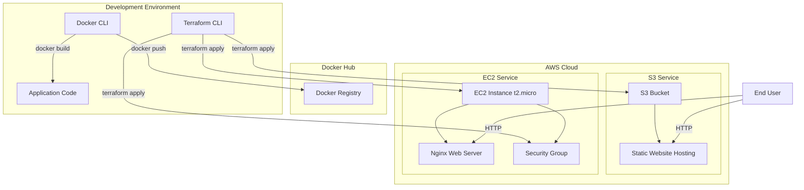
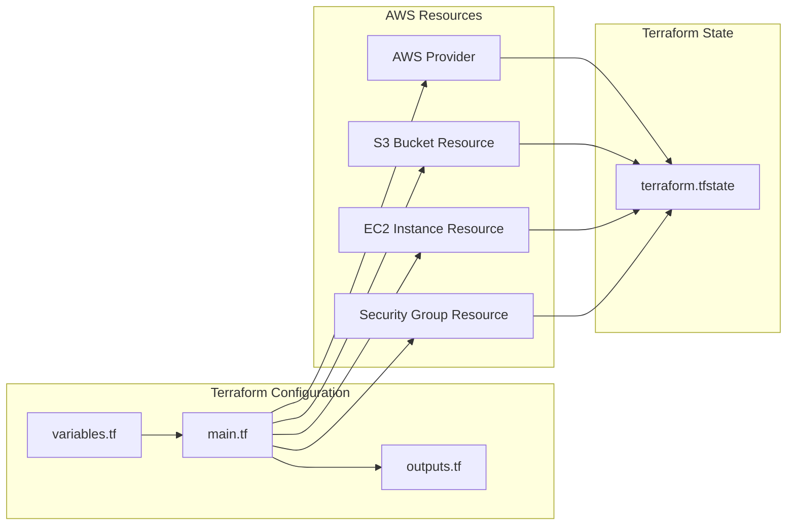
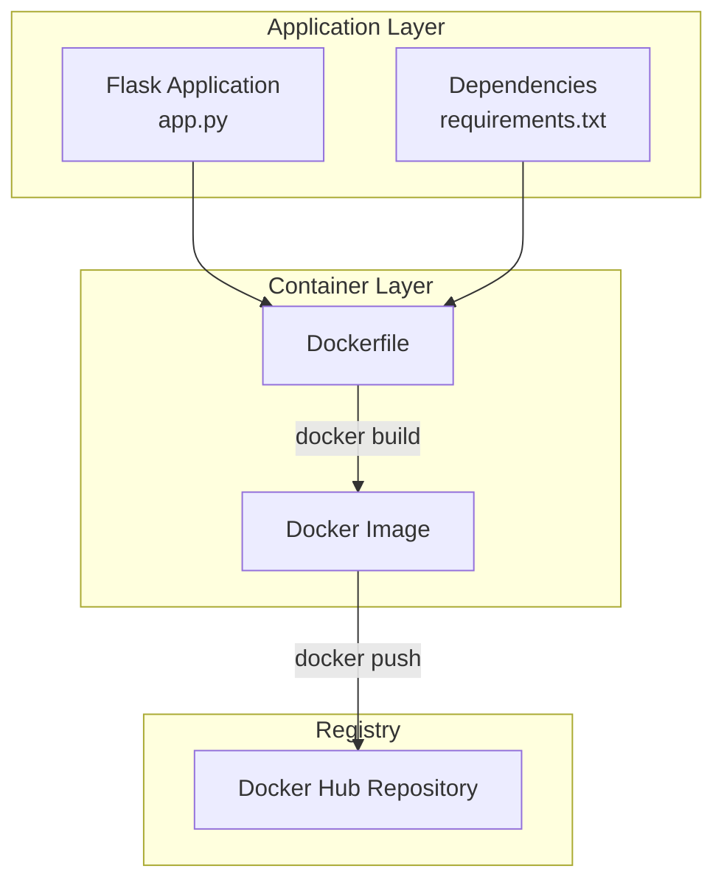
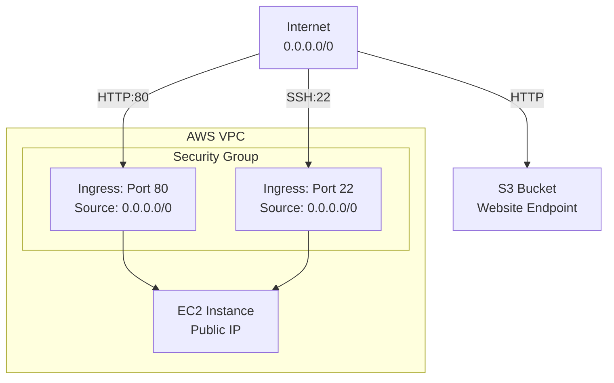

# Design Document

## Overview

This design document specifies the technical architecture and implementation approach for a comprehensive DevOps practical assignment that demonstrates Infrastructure as Code (IaC) using Terraform, containerization with Docker, and cloud infrastructure deployment on AWS.

The system consists of three primary components:

1. **Terraform Infrastructure Provisioning**: Declarative infrastructure management for AWS resources including S3 buckets and EC2 instances
2. **Docker Containerized Application**: A Flask-based web application packaged as a Docker image and published to Docker Hub
3. **AWS Deployment Architecture**: Static website hosting on S3 and dynamic web server deployment on EC2 with Nginx

### Design Philosophy

This design follows Infrastructure as Code (IaC) principles where infrastructure is defined declaratively using Terraform configuration files. This approach provides:

- **Version Control**: Infrastructure definitions can be tracked in Git
- **Reproducibility**: Infrastructure can be recreated consistently across environments
- **Automation**: Resource provisioning and destruction are automated via Terraform CLI
- **Documentation**: Infrastructure code serves as living documentation

### Key Technical Decisions

1. **Terraform for Infrastructure Management**: Use Terraform as the primary IaC tool for all AWS resource provisioning, enabling declarative infrastructure definition and state management
2. **EC2 User Data for Automation**: Leverage EC2 user_data scripts to automate Nginx installation and configuration at instance launch time, eliminating manual setup steps
3. **Separate Docker Workflow**: Keep Docker image build and push workflow independent from Terraform infrastructure provisioning, as they serve different purposes
4. **Public Access Configuration**: Configure S3 bucket policies and EC2 security groups to allow public HTTP access for demonstration purposes
5. **AWS Free Tier Resources**: Use t2.micro instance type to remain within AWS Free Tier eligibility

## Architecture

### High-Level System Architecture



### Terraform Infrastructure Architecture



### Docker Application Architecture



### Network and Security Architecture



## Components and Interfaces

### Terraform Configuration Components

#### 1. Provider Configuration

**Purpose**: Configure AWS provider with region and authentication

**Configuration**:
```hcl
provider "aws" {
  region = var.aws_region
}
```

**Interface**:
- Input: AWS credentials from environment variables or ~/.aws/credentials
- Input: Region specification via variable
- Output: Authenticated AWS API client


#### 2. S3 Bucket Resource

**Purpose**: Provision S3 bucket with versioning and static website hosting

**Configuration Structure**:
```hcl
resource "aws_s3_bucket" "website_bucket" {
  bucket = var.bucket_name
}

resource "aws_s3_bucket_versioning" "website_versioning" {
  bucket = aws_s3_bucket.website_bucket.id
  versioning_configuration {
    status = "Enabled"
  }
}

resource "aws_s3_bucket_website_configuration" "website_config" {
  bucket = aws_s3_bucket.website_bucket.id
  index_document {
    suffix = "index.html"
  }
}

resource "aws_s3_bucket_public_access_block" "website_public_access" {
  bucket = aws_s3_bucket.website_bucket.id
  block_public_acls       = false
  block_public_policy     = false
  ignore_public_acls      = false
  restrict_public_buckets = false
}

resource "aws_s3_bucket_policy" "website_policy" {
  bucket = aws_s3_bucket.website_bucket.id
  policy = jsonencode({
    Version = "2012-10-17"
    Statement = [
      {
        Sid       = "PublicReadGetObject"
        Effect    = "Allow"
        Principal = "*"
        Action    = "s3:GetObject"
        Resource  = "${aws_s3_bucket.website_bucket.arn}/*"
      }
    ]
  })
}
```

**Interface**:
- Input: Bucket name (must be globally unique)
- Output: Bucket website endpoint URL
- Output: Bucket ARN for policy attachment


#### 3. Security Group Resource

**Purpose**: Define firewall rules for EC2 instance

**Configuration Structure**:
```hcl
resource "aws_security_group" "web_sg" {
  name        = "web-server-sg"
  description = "Security group for web server"

  ingress {
    description = "HTTP from Internet"
    from_port   = 80
    to_port     = 80
    protocol    = "tcp"
    cidr_blocks = ["0.0.0.0/0"]
  }

  ingress {
    description = "SSH from Internet"
    from_port   = 22
    to_port     = 22
    protocol    = "tcp"
    cidr_blocks = ["0.0.0.0/0"]
  }

  egress {
    description = "Allow all outbound"
    from_port   = 0
    to_port     = 0
    protocol    = "-1"
    cidr_blocks = ["0.0.0.0/0"]
  }
}
```

**Interface**:
- Input: Ingress rules (port 80, port 22)
- Input: Egress rules (all traffic)
- Output: Security group ID for EC2 association

#### 4. EC2 Instance Resource

**Purpose**: Provision EC2 instance with automated Nginx installation

**Configuration Structure**:
```hcl
resource "aws_instance" "web_server" {
  ami                    = var.ami_id
  instance_type          = "t2.micro"
  key_name              = var.key_pair_name
  vpc_security_group_ids = [aws_security_group.web_sg.id]

  user_data = <<-EOF
              #!/bin/bash
              # Update system packages
              yum update -y  # For Amazon Linux 2
              # OR: apt-get update -y && apt-get upgrade -y  # For Ubuntu
              
              # Install Nginx
              yum install -y nginx  # For Amazon Linux 2
              # OR: apt-get install -y nginx  # For Ubuntu
              
              # Create custom index page
              echo "Hello from EC2 Nginx" > /usr/share/nginx/html/index.html
              # OR: echo "Hello from EC2 Nginx" > /var/www/html/index.html  # For Ubuntu
              
              # Start and enable Nginx
              systemctl start nginx
              systemctl enable nginx
              EOF

  tags = {
    Name = "WebServer"
  }
}
```


**Interface**:
- Input: AMI ID (Amazon Linux 2 or Ubuntu 22.04)
- Input: Instance type (t2.micro)
- Input: Key pair name for SSH access
- Input: Security group ID
- Input: User data script for automation
- Output: Public IP address
- Output: Instance ID

#### 5. Output Values

**Purpose**: Export important resource attributes for user reference

**Configuration Structure**:
```hcl
output "s3_website_endpoint" {
  description = "S3 bucket website endpoint URL"
  value       = aws_s3_bucket_website_configuration.website_config.website_endpoint
}

output "ec2_public_ip" {
  description = "EC2 instance public IP address"
  value       = aws_instance.web_server.public_ip
}

output "bucket_name" {
  description = "S3 bucket name"
  value       = aws_s3_bucket.website_bucket.id
}
```

**Interface**:
- Output: S3 website endpoint URL (http://{bucket-name}.s3-website-{region}.amazonaws.com)
- Output: EC2 public IP address
- Output: S3 bucket name

### Docker Application Components

#### 1. Flask Application (app.py)

**Purpose**: Simple web application that returns a greeting message

**Implementation Structure**:
```python
from flask import Flask

app = Flask(__name__)

@app.route('/')
def hello():
    return "Hello from Docker"

if __name__ == '__main__':
    app.run(host='0.0.0.0', port=5000)
```

**Interface**:
- Input: HTTP GET request to "/"
- Output: HTTP 200 response with "Hello from Docker" text
- Port: 5000


#### 2. Dependencies (requirements.txt)

**Purpose**: Specify Python package dependencies

**Content**:
```
Flask==2.3.0
```

**Interface**:
- Input: Package specifications
- Output: Installed packages in container

#### 3. Dockerfile

**Purpose**: Define container image build instructions

**Implementation Structure**:
```dockerfile
FROM python:3.9-slim

WORKDIR /app

COPY requirements.txt .
RUN pip install --no-cache-dir -r requirements.txt

COPY app.py .

EXPOSE 5000

CMD ["python", "app.py"]
```

**Build Process**:
1. Start from python:3.9-slim base image
2. Set working directory to /app
3. Copy and install dependencies
4. Copy application code
5. Expose port 5000
6. Define startup command

**Interface**:
- Input: Application code and dependencies
- Output: Docker image with Flask application
- Exposed Port: 5000

### AWS Service Components

#### 1. S3 Static Website Hosting

**Purpose**: Host static HTML content with public HTTP access

**Configuration**:
- Index document: index.html
- Versioning: Enabled
- Public access: Allowed via bucket policy
- Website endpoint: http://{bucket-name}.s3-website-{region}.amazonaws.com

**Interface**:
- Input: HTML files uploaded to bucket
- Output: HTTP responses serving static content
- Access: Public read via bucket policy


#### 2. EC2 Instance with Nginx

**Purpose**: Run Nginx web server on a virtual machine

**Configuration**:
- Instance type: t2.micro (Free Tier eligible)
- Operating system: Amazon Linux 2 or Ubuntu 22.04
- Web server: Nginx
- Automation: User data script for installation
- Network: Public IP with HTTP and SSH access

**Interface**:
- Input: HTTP requests on port 80
- Output: HTTP responses serving Nginx content
- Access: Public via security group rules

## Data Models

### Terraform State Model

**Purpose**: Track the current state of managed infrastructure

**Structure**:
```json
{
  "version": 4,
  "terraform_version": "1.x.x",
  "resources": [
    {
      "type": "aws_s3_bucket",
      "name": "website_bucket",
      "instances": [
        {
          "attributes": {
            "id": "bucket-name",
            "arn": "arn:aws:s3:::bucket-name",
            "bucket": "bucket-name",
            "region": "us-east-1"
          }
        }
      ]
    },
    {
      "type": "aws_instance",
      "name": "web_server",
      "instances": [
        {
          "attributes": {
            "id": "i-xxxxxxxxx",
            "public_ip": "x.x.x.x",
            "instance_type": "t2.micro",
            "ami": "ami-xxxxxxxxx"
          }
        }
      ]
    }
  ]
}
```

**Attributes**:
- `version`: Terraform state format version
- `terraform_version`: Terraform CLI version used
- `resources`: Array of managed resources with their current attributes


### S3 Bucket Policy Model

**Purpose**: Define public read access permissions

**Structure**:
```json
{
  "Version": "2012-10-17",
  "Statement": [
    {
      "Sid": "PublicReadGetObject",
      "Effect": "Allow",
      "Principal": "*",
      "Action": "s3:GetObject",
      "Resource": "arn:aws:s3:::bucket-name/*"
    }
  ]
}
```

**Attributes**:
- `Version`: IAM policy language version
- `Statement`: Array of permission statements
- `Effect`: Allow or Deny
- `Principal`: Who can access (wildcard for public)
- `Action`: Permitted operations (s3:GetObject for read)
- `Resource`: Target resources (all objects in bucket)

### Security Group Rules Model

**Purpose**: Define network access control rules

**Ingress Rules**:
```json
[
  {
    "from_port": 80,
    "to_port": 80,
    "protocol": "tcp",
    "cidr_blocks": ["0.0.0.0/0"],
    "description": "HTTP from Internet"
  },
  {
    "from_port": 22,
    "to_port": 22,
    "protocol": "tcp",
    "cidr_blocks": ["0.0.0.0/0"],
    "description": "SSH from Internet"
  }
]
```

**Egress Rules**:
```json
[
  {
    "from_port": 0,
    "to_port": 0,
    "protocol": "-1",
    "cidr_blocks": ["0.0.0.0/0"],
    "description": "Allow all outbound"
  }
]
```

**Attributes**:
- `from_port`: Starting port number
- `to_port`: Ending port number
- `protocol`: Network protocol (tcp, udp, icmp, or -1 for all)
- `cidr_blocks`: Source/destination IP ranges
- `description`: Human-readable rule description


### Docker Image Metadata Model

**Purpose**: Store image identification and registry information

**Structure**:
```json
{
  "repository": "username/flask-app",
  "tag": "latest",
  "image_id": "sha256:xxxxx",
  "created": "2024-01-01T00:00:00Z",
  "size": "150MB",
  "layers": [
    "sha256:layer1",
    "sha256:layer2",
    "sha256:layer3"
  ]
}
```

**Attributes**:
- `repository`: Docker Hub repository name
- `tag`: Image version tag
- `image_id`: Unique image identifier
- `created`: Image creation timestamp
- `size`: Total image size
- `layers`: Array of layer identifiers

## Error Handling

### Terraform Error Handling

#### 1. Authentication Errors

**Scenario**: Invalid or missing AWS credentials

**Detection**:
```
Error: error configuring Terraform AWS Provider: no valid credential sources found
```

**Handling Strategy**:
- Validate AWS credentials before running terraform commands
- Provide clear error message directing user to run `aws configure`
- Check for presence of ~/.aws/credentials file
- Verify AWS_ACCESS_KEY_ID and AWS_SECRET_ACCESS_KEY environment variables

**User Guidance**:
```bash
# Configure AWS credentials
aws configure
# Enter: AWS Access Key ID, Secret Access Key, Region, Output format
```

#### 2. Resource Already Exists Errors

**Scenario**: S3 bucket name already taken globally

**Detection**:
```
Error: error creating S3 bucket: BucketAlreadyExists: The requested bucket name is not available
```

**Handling Strategy**:
- Use unique bucket naming convention (e.g., prefix with username or timestamp)
- Implement bucket name validation in variables
- Provide fallback naming strategy

**User Guidance**:
- Modify bucket name in variables.tf to ensure global uniqueness
- Consider format: `{username}-devops-assignment-{timestamp}`


#### 3. AMI Not Found Errors

**Scenario**: Specified AMI ID not available in region

**Detection**:
```
Error: error launching instance: InvalidAMIID.NotFound
```

**Handling Strategy**:
- Use data source to dynamically fetch latest AMI
- Provide region-specific AMI mappings
- Document AMI selection process

**Implementation**:
```hcl
data "aws_ami" "amazon_linux_2" {
  most_recent = true
  owners      = ["amazon"]
  
  filter {
    name   = "name"
    values = ["amzn2-ami-hvm-*-x86_64-gp2"]
  }
}

resource "aws_instance" "web_server" {
  ami = data.aws_ami.amazon_linux_2.id
  # ... other configuration
}
```

#### 4. Key Pair Not Found Errors

**Scenario**: Specified SSH key pair doesn't exist in AWS

**Detection**:
```
Error: error launching instance: InvalidKeyPair.NotFound
```

**Handling Strategy**:
- Make key_name variable optional
- Provide instructions for creating key pair
- Allow instance creation without key pair if SSH access not required

**User Guidance**:
```bash
# Create EC2 key pair
aws ec2 create-key-pair --key-name my-key-pair --query 'KeyMaterial' --output text > my-key-pair.pem
chmod 400 my-key-pair.pem
```

#### 5. State Lock Errors

**Scenario**: Terraform state is locked by another process

**Detection**:
```
Error: Error acquiring the state lock
```

**Handling Strategy**:
- Wait for other terraform operations to complete
- Use `terraform force-unlock` only if process crashed
- Implement remote state with DynamoDB locking for team environments

**User Guidance**:
```bash
# If terraform process crashed, force unlock (use with caution)
terraform force-unlock <lock-id>
```


### Docker Error Handling

#### 1. Docker Daemon Not Running

**Scenario**: Docker service is not started

**Detection**:
```
Cannot connect to the Docker daemon. Is the docker daemon running?
```

**Handling Strategy**:
- Check Docker service status before operations
- Provide platform-specific startup instructions
- Verify Docker installation

**User Guidance**:
```bash
# Linux
sudo systemctl start docker
sudo systemctl enable docker

# macOS/Windows
# Start Docker Desktop application
```

#### 2. Docker Hub Authentication Errors

**Scenario**: Invalid Docker Hub credentials

**Detection**:
```
Error: unauthorized: incorrect username or password
```

**Handling Strategy**:
- Prompt for docker login before push operations
- Validate authentication status
- Provide clear credential error messages

**User Guidance**:
```bash
# Login to Docker Hub
docker login
# Enter username and password when prompted
```

#### 3. Image Build Errors

**Scenario**: Dockerfile syntax errors or missing dependencies

**Detection**:
```
Error: failed to solve: failed to compute cache key
```

**Handling Strategy**:
- Validate Dockerfile syntax
- Ensure all COPY source files exist
- Check base image availability
- Provide detailed build logs

**User Guidance**:
- Review Dockerfile for syntax errors
- Verify all referenced files exist in build context
- Check network connectivity for base image pull


#### 4. Image Push Errors

**Scenario**: Network issues or repository access denied

**Detection**:
```
Error: denied: requested access to the resource is denied
```

**Handling Strategy**:
- Verify Docker Hub authentication
- Check repository name format (username/image:tag)
- Ensure repository exists or can be created
- Retry with exponential backoff for network issues

**User Guidance**:
- Verify image tag format: `docker tag local-image username/repository:tag`
- Ensure Docker Hub repository name matches username
- Check Docker Hub account status

### AWS Service Error Handling

#### 1. S3 Upload Errors

**Scenario**: Permission denied or network timeout during file upload

**Detection**:
```
Error: error uploading object to S3: AccessDenied
```

**Handling Strategy**:
- Verify AWS credentials have s3:PutObject permission
- Check bucket policy allows uploads
- Implement retry logic for network failures
- Validate file exists before upload

**User Guidance**:
```bash
# Upload file to S3 using AWS CLI
aws s3 cp index.html s3://bucket-name/
# Verify upload
aws s3 ls s3://bucket-name/
```

#### 2. EC2 Instance Launch Failures

**Scenario**: Insufficient capacity or quota limits

**Detection**:
```
Error: error launching instance: InsufficientInstanceCapacity
```

**Handling Strategy**:
- Retry in different availability zone
- Check AWS service quotas
- Verify instance type availability in region
- Provide alternative instance type suggestions

**User Guidance**:
- Try different AWS region
- Check AWS Service Quotas dashboard
- Contact AWS support for quota increase if needed


#### 3. Security Group Rule Conflicts

**Scenario**: Overlapping or conflicting security group rules

**Detection**:
```
Error: error creating Security Group: InvalidPermission.Duplicate
```

**Handling Strategy**:
- Check for existing security groups with same rules
- Use unique security group names
- Implement idempotent rule creation
- Clean up orphaned security groups

**User Guidance**:
- Review existing security groups in AWS console
- Use terraform destroy to clean up previous resources
- Ensure unique naming for security groups

#### 4. User Data Script Failures

**Scenario**: Nginx installation fails in user_data script

**Detection**:
- Instance launches but Nginx not accessible
- Check /var/log/cloud-init-output.log on instance

**Handling Strategy**:
- Implement error logging in user_data script
- Add retry logic for package installation
- Verify package manager commands for OS type
- Provide fallback manual installation instructions

**User Guidance**:
```bash
# SSH into instance to debug
ssh -i key-pair.pem ec2-user@<public-ip>

# Check cloud-init logs
sudo cat /var/log/cloud-init-output.log

# Manually install Nginx if needed
sudo yum install -y nginx  # Amazon Linux
sudo systemctl start nginx
```

## Testing Strategy

### Infrastructure Testing Approach

Since this project involves Infrastructure as Code (IaC) using Terraform, **property-based testing is not applicable**. Instead, we will use the following testing strategies:

#### 1. Terraform Validation and Planning

**Purpose**: Validate Terraform configuration syntax and preview changes

**Approach**:
```bash
# Validate configuration syntax
terraform validate

# Format configuration files
terraform fmt -check

# Preview infrastructure changes
terraform plan
```

**Validation Checks**:
- Syntax correctness of .tf files
- Resource dependency resolution
- Variable type validation
- Provider configuration validity


#### 2. Infrastructure Deployment Testing

**Purpose**: Verify successful resource provisioning

**Test Cases**:

**Test 1: S3 Bucket Creation and Configuration**
- Execute: `terraform apply`
- Verify: S3 bucket exists with specified name
- Verify: Versioning is enabled
- Verify: Static website hosting is configured
- Verify: Bucket policy allows public read access
- Verify: Public access block settings are disabled
- Expected: All S3 resources created successfully

**Test 2: EC2 Instance Provisioning**
- Execute: `terraform apply`
- Verify: EC2 instance is running
- Verify: Instance type is t2.micro
- Verify: Public IP is assigned
- Verify: Security group is attached
- Verify: User data script executed successfully
- Expected: Instance accessible via SSH and HTTP

**Test 3: Security Group Configuration**
- Execute: `terraform apply`
- Verify: Security group exists
- Verify: Ingress rule for port 80 from 0.0.0.0/0
- Verify: Ingress rule for port 22 from 0.0.0.0/0
- Verify: Egress rule allows all outbound traffic
- Expected: Security group rules configured correctly

**Test 4: Terraform Outputs**
- Execute: `terraform output`
- Verify: s3_website_endpoint is displayed
- Verify: ec2_public_ip is displayed
- Verify: bucket_name is displayed
- Expected: All outputs contain valid values

#### 3. Functional Testing

**Purpose**: Verify deployed services are accessible and functional

**Test Cases**:

**Test 5: S3 Static Website Accessibility**
- Action: Navigate to S3 website endpoint URL in browser
- Expected: HTTP 200 response
- Expected: Page displays "Hello from S3" content
- Validation: `curl http://{bucket-name}.s3-website-{region}.amazonaws.com`

**Test 6: EC2 Nginx Accessibility**
- Action: Navigate to EC2 public IP in browser
- Expected: HTTP 200 response
- Expected: Page displays "Hello from EC2 Nginx" content
- Validation: `curl http://{ec2-public-ip}`

**Test 7: Nginx Service Status**
- Action: SSH into EC2 instance
- Command: `sudo systemctl status nginx`
- Expected: Nginx service is active and running
- Expected: Service is enabled for auto-start


#### 4. Docker Application Testing

**Purpose**: Verify Docker image builds and runs correctly

**Test Cases**:

**Test 8: Docker Image Build**
- Action: `docker build -t flask-app .`
- Expected: Build completes without errors
- Expected: Image appears in `docker images` list
- Validation: Check for successful build output

**Test 9: Docker Container Execution**
- Action: `docker run -p 5000:5000 flask-app`
- Expected: Container starts without errors
- Expected: Flask application accessible on localhost:5000
- Validation: `curl http://localhost:5000`
- Expected Response: "Hello from Docker"

**Test 10: Docker Hub Push**
- Action: `docker push username/flask-app:latest`
- Expected: Image pushed successfully to Docker Hub
- Expected: Image visible in Docker Hub web interface
- Validation: Check Docker Hub repository page

#### 5. Integration Testing

**Purpose**: Verify end-to-end workflow and component interactions

**Test Cases**:

**Test 11: Complete Infrastructure Provisioning**
- Action: Run `terraform apply` from clean state
- Expected: All resources created in correct order
- Expected: No dependency errors
- Expected: State file updated correctly
- Validation: Verify all resources in AWS console

**Test 12: Resource Cleanup**
- Action: Run `terraform destroy`
- Expected: All resources deleted successfully
- Expected: State file shows no managed resources
- Expected: AWS console shows no orphaned resources
- Validation: Check AWS console for resource cleanup

**Test 13: Infrastructure Reproducibility**
- Action: Run `terraform apply`, then `terraform destroy`, then `terraform apply` again
- Expected: Infrastructure recreated identically
- Expected: Same resource attributes (except dynamic values like IPs)
- Validation: Compare terraform state before and after

#### 6. Security Testing

**Purpose**: Verify security configurations are correct

**Test Cases**:

**Test 14: S3 Public Access**
- Action: Access S3 website endpoint without authentication
- Expected: Content accessible publicly
- Validation: Verify bucket policy allows s3:GetObject for all principals

**Test 15: EC2 Security Group Rules**
- Action: Attempt HTTP connection to EC2 instance
- Expected: Connection successful on port 80
- Action: Attempt SSH connection to EC2 instance
- Expected: Connection successful on port 22 (with valid key)
- Validation: Verify security group rules in AWS console


#### 7. Compliance and Policy Testing

**Purpose**: Verify infrastructure meets requirements and best practices

**Test Cases**:

**Test 16: AWS Free Tier Compliance**
- Validation: Verify EC2 instance type is t2.micro
- Validation: Verify only one EC2 instance is created
- Expected: Configuration eligible for AWS Free Tier

**Test 17: Terraform State Management**
- Validation: Verify terraform.tfstate file exists
- Validation: Verify state file contains all managed resources
- Validation: Verify state file is not committed to version control (.gitignore)
- Expected: State management follows best practices

**Test 18: Resource Tagging**
- Validation: Verify EC2 instance has Name tag
- Validation: Verify resources are identifiable
- Expected: Resources properly tagged for management

### Testing Tools and Commands

#### Terraform Testing Commands
```bash
# Initialize Terraform
terraform init

# Validate configuration
terraform validate

# Format configuration
terraform fmt -check

# Plan infrastructure changes
terraform plan

# Apply infrastructure changes
terraform apply

# Show current state
terraform show

# List outputs
terraform output

# Destroy infrastructure
terraform destroy
```

#### AWS CLI Testing Commands
```bash
# Verify S3 bucket
aws s3 ls s3://bucket-name

# Check EC2 instances
aws ec2 describe-instances --filters "Name=tag:Name,Values=WebServer"

# Verify security groups
aws ec2 describe-security-groups --group-names web-server-sg

# Test S3 website endpoint
curl http://bucket-name.s3-website-region.amazonaws.com

# Test EC2 Nginx
curl http://ec2-public-ip
```

#### Docker Testing Commands
```bash
# Build image
docker build -t flask-app .

# Run container locally
docker run -d -p 5000:5000 flask-app

# Test application
curl http://localhost:5000

# Tag image
docker tag flask-app username/flask-app:latest

# Push to Docker Hub
docker push username/flask-app:latest

# Verify image on Docker Hub
docker pull username/flask-app:latest
```


### Manual Verification Checklist

After deployment, perform these manual verification steps:

**S3 Static Website**:
- [ ] S3 bucket created with unique name
- [ ] Versioning enabled on bucket
- [ ] Static website hosting configured
- [ ] index.html uploaded to bucket
- [ ] Bucket policy allows public read access
- [ ] Website endpoint accessible in browser
- [ ] Content displays "Hello from S3"

**Docker Application**:
- [ ] Flask application code created
- [ ] Dockerfile created with correct configuration
- [ ] Docker image builds successfully
- [ ] Container runs locally and serves content
- [ ] Image tagged with Docker Hub repository name
- [ ] Image pushed to Docker Hub successfully
- [ ] Image visible in Docker Hub web interface

**EC2 and Nginx**:
- [ ] EC2 instance launched successfully
- [ ] Instance has public IP address
- [ ] Security group allows HTTP and SSH
- [ ] Nginx installed via user_data script
- [ ] Nginx service running and enabled
- [ ] Custom content deployed to Nginx
- [ ] EC2 public IP accessible in browser
- [ ] Content displays "Hello from EC2 Nginx"

**Terraform Infrastructure**:
- [ ] All .tf files created (main.tf, variables.tf, outputs.tf)
- [ ] terraform init completed successfully
- [ ] terraform validate passes
- [ ] terraform plan shows expected resources
- [ ] terraform apply creates all resources
- [ ] terraform output displays correct values
- [ ] terraform destroy removes all resources

## Implementation Approach

### Phase 1: Project Setup and Configuration

#### Step 1.1: Create Project Structure
```
devops-assignment/
├── terraform/
│   ├── main.tf
│   ├── variables.tf
│   ├── outputs.tf
│   └── terraform.tfvars (optional, for variable values)
├── docker-app/
│   ├── app.py
│   ├── requirements.txt
│   └── Dockerfile
└── static-content/
    └── index.html
```

#### Step 1.2: Configure AWS Credentials
```bash
# Install AWS CLI if not already installed
# Configure credentials
aws configure
# Enter: Access Key ID, Secret Access Key, Region (e.g., us-east-1), Output format (json)
```

#### Step 1.3: Install Required Tools
- Terraform (version 1.0+)
- AWS CLI (version 2.0+)
- Docker (version 20.0+)
- Git (for version control)


### Phase 2: Terraform Infrastructure Development

#### Step 2.1: Create variables.tf
Define input variables for configuration:
```hcl
variable "aws_region" {
  description = "AWS region for resources"
  type        = string
  default     = "us-east-1"
}

variable "bucket_name" {
  description = "S3 bucket name (must be globally unique)"
  type        = string
}

variable "ami_id" {
  description = "AMI ID for EC2 instance"
  type        = string
}

variable "key_pair_name" {
  description = "EC2 key pair name for SSH access"
  type        = string
}

variable "instance_type" {
  description = "EC2 instance type"
  type        = string
  default     = "t2.micro"
}
```

#### Step 2.2: Create main.tf
Define all AWS resources:
1. AWS provider configuration
2. S3 bucket with versioning
3. S3 bucket website configuration
4. S3 bucket public access settings
5. S3 bucket policy
6. Security group with HTTP and SSH rules
7. EC2 instance with user_data script

#### Step 2.3: Create outputs.tf
Define output values:
```hcl
output "s3_website_endpoint" {
  description = "S3 bucket website endpoint URL"
  value       = "http://${aws_s3_bucket_website_configuration.website_config.website_endpoint}"
}

output "ec2_public_ip" {
  description = "EC2 instance public IP address"
  value       = aws_instance.web_server.public_ip
}

output "bucket_name" {
  description = "S3 bucket name"
  value       = aws_s3_bucket.website_bucket.id
}

output "ssh_command" {
  description = "SSH command to connect to EC2 instance"
  value       = "ssh -i ${var.key_pair_name}.pem ec2-user@${aws_instance.web_server.public_ip}"
}
```

#### Step 2.4: Initialize and Validate Terraform
```bash
cd terraform/
terraform init
terraform validate
terraform fmt
```


### Phase 3: Docker Application Development

#### Step 3.1: Create Flask Application
Create `docker-app/app.py`:
```python
from flask import Flask

app = Flask(__name__)

@app.route('/')
def hello():
    return "Hello from Docker"

if __name__ == '__main__':
    app.run(host='0.0.0.0', port=5000, debug=False)
```

#### Step 3.2: Create Requirements File
Create `docker-app/requirements.txt`:
```
Flask==2.3.0
Werkzeug==2.3.0
```

#### Step 3.3: Create Dockerfile
Create `docker-app/Dockerfile`:
```dockerfile
FROM python:3.9-slim

WORKDIR /app

COPY requirements.txt .
RUN pip install --no-cache-dir -r requirements.txt

COPY app.py .

EXPOSE 5000

CMD ["python", "app.py"]
```

#### Step 3.4: Build and Test Docker Image Locally
```bash
cd docker-app/

# Build image
docker build -t flask-app .

# Run container
docker run -d -p 5000:5000 --name flask-test flask-app

# Test application
curl http://localhost:5000
# Expected: "Hello from Docker"

# Stop and remove test container
docker stop flask-test
docker rm flask-test
```

#### Step 3.5: Push to Docker Hub
```bash
# Login to Docker Hub
docker login
# Enter username and password

# Tag image with Docker Hub repository name
docker tag flask-app <dockerhub-username>/flask-app:latest

# Push to Docker Hub
docker push <dockerhub-username>/flask-app:latest

# Verify on Docker Hub
# Visit: https://hub.docker.com/r/<dockerhub-username>/flask-app
```


### Phase 4: AWS Infrastructure Deployment

#### Step 4.1: Create EC2 Key Pair (if not exists)
```bash
# Create key pair
aws ec2 create-key-pair \
  --key-name devops-assignment-key \
  --query 'KeyMaterial' \
  --output text > devops-assignment-key.pem

# Set permissions
chmod 400 devops-assignment-key.pem
```

#### Step 4.2: Determine AMI ID
```bash
# For Amazon Linux 2
aws ec2 describe-images \
  --owners amazon \
  --filters "Name=name,Values=amzn2-ami-hvm-*-x86_64-gp2" \
  --query 'Images[0].ImageId' \
  --output text

# For Ubuntu 22.04
aws ec2 describe-images \
  --owners 099720109477 \
  --filters "Name=name,Values=ubuntu/images/hvm-ssd/ubuntu-jammy-22.04-amd64-server-*" \
  --query 'Images[0].ImageId' \
  --output text
```

#### Step 4.3: Create terraform.tfvars
Create `terraform/terraform.tfvars`:
```hcl
aws_region     = "us-east-1"
bucket_name    = "your-unique-bucket-name-12345"
ami_id         = "ami-xxxxxxxxx"  # From Step 4.2
key_pair_name  = "devops-assignment-key"
instance_type  = "t2.micro"
```

#### Step 4.4: Plan Infrastructure Changes
```bash
cd terraform/
terraform plan
# Review planned changes
# Verify: 1 S3 bucket, 1 EC2 instance, 1 security group, and related resources
```

#### Step 4.5: Apply Infrastructure
```bash
terraform apply
# Review plan
# Type 'yes' to confirm

# Wait for resources to be created (2-3 minutes)
# Note the output values
```

#### Step 4.6: Verify Outputs
```bash
terraform output
# Should display:
# - s3_website_endpoint
# - ec2_public_ip
# - bucket_name
# - ssh_command
```


### Phase 5: S3 Static Content Deployment

#### Step 5.1: Create Static HTML Content
Create `static-content/index.html`:
```html
<!DOCTYPE html>
<html lang="en">
<head>
    <meta charset="UTF-8">
    <meta name="viewport" content="width=device-width, initial-scale=1.0">
    <title>DevOps Assignment - S3</title>
</head>
<body>
    <h1>Hello from S3</h1>
    <p>This static website is hosted on AWS S3.</p>
</body>
</html>
```

#### Step 5.2: Upload to S3
```bash
# Get bucket name from Terraform output
BUCKET_NAME=$(terraform output -raw bucket_name)

# Upload index.html
aws s3 cp ../static-content/index.html s3://$BUCKET_NAME/

# Verify upload
aws s3 ls s3://$BUCKET_NAME/
```

#### Step 5.3: Test S3 Website
```bash
# Get website endpoint from Terraform output
S3_ENDPOINT=$(terraform output -raw s3_website_endpoint)

# Test with curl
curl $S3_ENDPOINT

# Or open in browser
echo "Open in browser: $S3_ENDPOINT"
```

#### Step 5.4: Take Screenshot
- Open S3 website endpoint in browser
- Verify "Hello from S3" content is displayed
- Take screenshot for documentation

### Phase 6: EC2 Nginx Verification

#### Step 6.1: Wait for User Data Script Completion
```bash
# SSH into EC2 instance
EC2_IP=$(terraform output -raw ec2_public_ip)
ssh -i devops-assignment-key.pem ec2-user@$EC2_IP

# Check cloud-init status
cloud-init status

# Wait until status shows "done"
# This may take 2-3 minutes after instance launch
```

#### Step 6.2: Verify Nginx Installation
```bash
# Check Nginx service status
sudo systemctl status nginx

# Verify Nginx is enabled
sudo systemctl is-enabled nginx

# Check Nginx configuration
sudo nginx -t

# View custom content
cat /usr/share/nginx/html/index.html
# Should display: "Hello from EC2 Nginx"
```


#### Step 6.3: Test Nginx from Outside
```bash
# Exit SSH session
exit

# Test with curl
curl http://$EC2_IP

# Expected output: "Hello from EC2 Nginx"
```

#### Step 6.4: Take Screenshot
- Open EC2 public IP in browser (http://EC2_IP)
- Verify "Hello from EC2 Nginx" content is displayed
- Take screenshot for documentation

### Phase 7: Documentation and Evidence Collection

#### Step 7.1: Collect URLs and IPs
```bash
# S3 Website Endpoint
terraform output s3_website_endpoint

# EC2 Public IP
terraform output ec2_public_ip

# Docker Hub Repository
echo "https://hub.docker.com/r/<dockerhub-username>/flask-app"
```

#### Step 7.2: Collect Screenshots
Required screenshots:
1. S3 static website displaying "Hello from S3"
2. Docker Hub repository showing pushed image
3. EC2 Nginx displaying "Hello from EC2 Nginx"
4. Terraform apply output showing successful resource creation
5. Terraform output showing all values

#### Step 7.3: Create Documentation
Document the following:
- Project structure and file organization
- Step-by-step implementation process
- Terraform configuration details
- Docker build and push process
- AWS resource URLs and IPs
- Screenshots of working deployments
- Troubleshooting steps encountered
- Commands used for each task

### Phase 8: Resource Cleanup

#### Step 8.1: Empty S3 Bucket
```bash
# S3 buckets must be empty before Terraform can destroy them
BUCKET_NAME=$(terraform output -raw bucket_name)
aws s3 rm s3://$BUCKET_NAME/ --recursive
```

#### Step 8.2: Destroy Infrastructure
```bash
cd terraform/
terraform destroy
# Review resources to be destroyed
# Type 'yes' to confirm

# Wait for destruction to complete (1-2 minutes)
```

#### Step 8.3: Verify Cleanup
```bash
# Check no EC2 instances remain
aws ec2 describe-instances --filters "Name=tag:Name,Values=WebServer" --query 'Reservations[*].Instances[*].[InstanceId,State.Name]'

# Check S3 bucket is deleted
aws s3 ls | grep $BUCKET_NAME

# Check security group is deleted
aws ec2 describe-security-groups --filters "Name=group-name,Values=web-server-sg"
```


#### Step 8.4: Optional - Delete Key Pair
```bash
# If key pair was created for this assignment only
aws ec2 delete-key-pair --key-name devops-assignment-key
rm devops-assignment-key.pem
```

## Detailed Implementation Specifications

### Terraform main.tf Complete Structure

```hcl
terraform {
  required_version = ">= 1.0"
  required_providers {
    aws = {
      source  = "hashicorp/aws"
      version = "~> 5.0"
    }
  }
}

provider "aws" {
  region = var.aws_region
}

# S3 Bucket for Static Website
resource "aws_s3_bucket" "website_bucket" {
  bucket = var.bucket_name

  tags = {
    Name        = "DevOps Assignment Website"
    Environment = "Learning"
  }
}

# Enable Versioning
resource "aws_s3_bucket_versioning" "website_versioning" {
  bucket = aws_s3_bucket.website_bucket.id

  versioning_configuration {
    status = "Enabled"
  }
}

# Configure Static Website Hosting
resource "aws_s3_bucket_website_configuration" "website_config" {
  bucket = aws_s3_bucket.website_bucket.id

  index_document {
    suffix = "index.html"
  }

  error_document {
    key = "error.html"
  }
}

# Disable Block Public Access
resource "aws_s3_bucket_public_access_block" "website_public_access" {
  bucket = aws_s3_bucket.website_bucket.id

  block_public_acls       = false
  block_public_policy     = false
  ignore_public_acls      = false
  restrict_public_buckets = false
}

# Bucket Policy for Public Read Access
resource "aws_s3_bucket_policy" "website_policy" {
  bucket = aws_s3_bucket.website_bucket.id

  policy = jsonencode({
    Version = "2012-10-17"
    Statement = [
      {
        Sid       = "PublicReadGetObject"
        Effect    = "Allow"
        Principal = "*"
        Action    = "s3:GetObject"
        Resource  = "${aws_s3_bucket.website_bucket.arn}/*"
      }
    ]
  })

  depends_on = [aws_s3_bucket_public_access_block.website_public_access]
}
```


# Security Group for EC2
resource "aws_security_group" "web_sg" {
  name        = "web-server-sg"
  description = "Security group for web server allowing HTTP and SSH"

  ingress {
    description = "HTTP from Internet"
    from_port   = 80
    to_port     = 80
    protocol    = "tcp"
    cidr_blocks = ["0.0.0.0/0"]
  }

  ingress {
    description = "SSH from Internet"
    from_port   = 22
    to_port     = 22
    protocol    = "tcp"
    cidr_blocks = ["0.0.0.0/0"]
  }

  egress {
    description = "Allow all outbound traffic"
    from_port   = 0
    to_port     = 0
    protocol    = "-1"
    cidr_blocks = ["0.0.0.0/0"]
  }

  tags = {
    Name = "WebServerSecurityGroup"
  }
}

# EC2 Instance with Nginx
resource "aws_instance" "web_server" {
  ami                    = var.ami_id
  instance_type          = var.instance_type
  key_name               = var.key_pair_name
  vpc_security_group_ids = [aws_security_group.web_sg.id]

  user_data = <<-EOF
              #!/bin/bash
              set -e
              
              # Log output to file for debugging
              exec > >(tee /var/log/user-data.log)
              exec 2>&1
              
              echo "Starting user data script..."
              
              # Detect OS and install Nginx accordingly
              if [ -f /etc/os-release ]; then
                . /etc/os-release
                OS=$ID
              fi
              
              if [ "$OS" = "amzn" ]; then
                echo "Detected Amazon Linux"
                yum update -y
                yum install -y nginx
                HTML_DIR="/usr/share/nginx/html"
              elif [ "$OS" = "ubuntu" ]; then
                echo "Detected Ubuntu"
                apt-get update -y
                apt-get install -y nginx
                HTML_DIR="/var/www/html"
              else
                echo "Unsupported OS"
                exit 1
              fi
              
              # Create custom index page
              echo "Hello from EC2 Nginx" > $HTML_DIR/index.html
              
              # Start and enable Nginx
              systemctl start nginx
              systemctl enable nginx
              
              echo "User data script completed successfully"
              EOF

  tags = {
    Name = "WebServer"
  }
}
```

