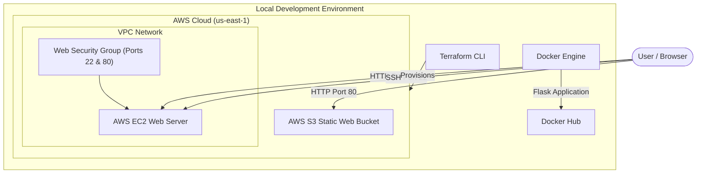

# DevOps Practical Assignment

This repository contains the complete, automated solution for the **DevOps Practical Assignment (Beginner to Intermediate)**. It leverages **Terraform** for full AWS infrastructure automation and **Docker** for local/containerized application hosting.

---

## 🚀 Deliverables Summary

| Deliverable | Details & Endpoints | Proof | Status |
|---|---|---|---|
| **Task 1: S3 Static Website** | [http://unlox-devops-assignment-898774459947.s3-website-us-east-1.amazonaws.com](http://unlox-devops-assignment-898774459947.s3-website-us-east-1.amazonaws.com) | `proofs/s3_static_website.png` | **🟢 Live & Verified** |
| **Task 2: Docker Hub Link** | [https://hub.docker.com/r/sanvith/flask-app](https://hub.docker.com/r/sanvith/flask-app) | `proofs/docker_hub_repository.png` | **🟢 Pushed & Verified** |
| **Task 3: EC2 Web Server** | [http://3.93.51.146](http://3.93.51.146) | `proofs/ec2_nginx_website.png` | **🟢 Live & Verified** |
| **Task 3: SSH Command** | `ssh -i terraform/unlox-devops-key.pem ec2-user@3.93.51.146` | `proofs/ec2_ssh_connection.png` | **🟢 Configured & Verified** |

---

## 🛠️ Architecture Overview

The following diagram illustrates how the system elements are provisioned and interact with each other:



---

## 📂 Project Structure

```plaintext
unlox/
├── docker/
│   ├── app.py               # Flask Python Application (Task 2)
│   ├── Dockerfile           # Custom Python 3.9-slim Image (Task 2)
│   └── requirements.txt     # Python Dependencies
├── terraform/
│   ├── s3_website/
│   │   └── index.html       # Static HTML Page (Task 1)
│   ├── main.tf              # Main Configuration (S3, EC2, SSH Key, Security Group)
│   ├── outputs.tf           # Terraform Output Variables
│   ├── variables.tf         # Input Variable Declarations
│   ├── terraform.tfvars     # Active deployment parameters
│   └── unlox-devops-key.pem # DYNAMICALLY GENERATED SSH PRIVATE KEY
├── proofs/                  # SUBMISSION PROOFS & SCREENSHOTS
│   ├── s3_static_website.png
│   ├── docker_hub_repository.png
│   ├── ec2_nginx_website.png
│   └── ec2_ssh_connection.png
├── README.md                # Solution Documentation (Deliverables & Walkthrough)
└── submission.md            # Highly-Polished Submission Report
```

---

## 📖 Task Details & Walkthroughs

### 🎯 Task 1: S3 Bucket Versioning + Static Website Hosting

**Goal**: Host a highly-available static website with version control using AWS S3.

1. **S3 Bucket Creation**: Provisioned a globally unique DNS-compliant S3 bucket named `unlox-devops-assignment-898774459947`.
2. **Public Access Block**: Configured bucket settings to disable block public ACLs/policies, allowing public access for website hosting.
3. **Static Hosting**: Configured the bucket for static website hosting with `index.html` as the index suffix document.
4. **Bucket Policy**: Added a public read policy (`s3:GetObject` to all resources `/*` from principal `*`).
5. **Website files + Versioning**: Enabled object versioning. The index page is loaded dynamically using Terraform:
   - File Path: [terraform/s3_website/index.html](terraform/s3_website/index.html)
   - Live endpoint: [S3 Endpoint](http://unlox-devops-assignment-898774459947.s3-website-us-east-1.amazonaws.com)

#### S3 Webpage Render Screenshot:


---

### 🎯 Task 2: Create Custom Dockerfile and Push to Docker Hub

**Goal**: Containerize the Python Flask application using Docker.

1. **Flask Application**: `docker/app.py` exposes a route returning `"Hello from Docker"` on port `5000`.
2. **Dockerfile Build**: The custom Docker image uses `python:3.9-slim` as the base image.
3. **Docker Hub Upload**: Image built, tagged, and pushed to Docker Hub under repository `sanvith/flask-app:latest`.

#### Docker Hub Repository Screenshot:


To run the container locally, execute:
```bash
docker run -d -p 5000:5000 sanvith/flask-app:latest
```

---

### 🎯 Task 3: Launch EC2 and Serve Nginx Page

**Goal**: Provision an EC2 instance that automates the deployment of a custom Nginx web server.

1. **VPC Network & Security Groups**: Provisions a security group `web-server-sg` permitting HTTP (port 80) and SSH (port 22) traffic from anywhere (`0.0.0.0/0`).
2. **Automated Key Pair Generation**: 
   - Uses the `tls_private_key` provider to generate a secure RSA 4096 private/public key pair.
   - Uploads the public key dynamically as an AWS Key Pair named `unlox-devops-key`.
   - Saves the private key file locally as `terraform/unlox-devops-key.pem` with restricted read-only permissions (`0600`).
3. **EC2 Provisioning**: Spawns a `t3.micro` instance (highly optimized, standard eligible free-tier instance) in `us-east-1` running Amazon Linux.
4. **Nginx Automation (User Data)**: A robust multi-distribution user data script runs on startup to install Nginx and serve a custom page.

#### EC2 Nginx Webpage Render Screenshot:


#### Secure SSH Terminal Connection Screenshot:


To connect via SSH:
```powershell
ssh -i terraform/unlox-devops-key.pem ec2-user@3.93.51.146
```

---

## 🧹 Cleaning Up Resources

To destroy all deployed AWS resources and avoid unnecessary charges, run:
```bash
cd terraform
terraform destroy -auto-approve
```
All resources (S3 buckets, objects, EC2 instance, SSH key pair, security group) will be cleaned up automatically.
