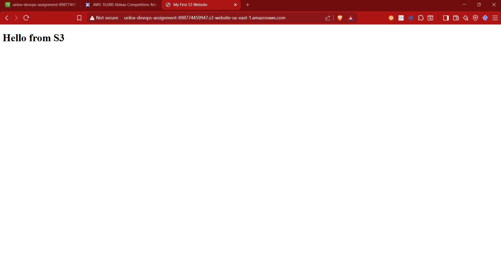
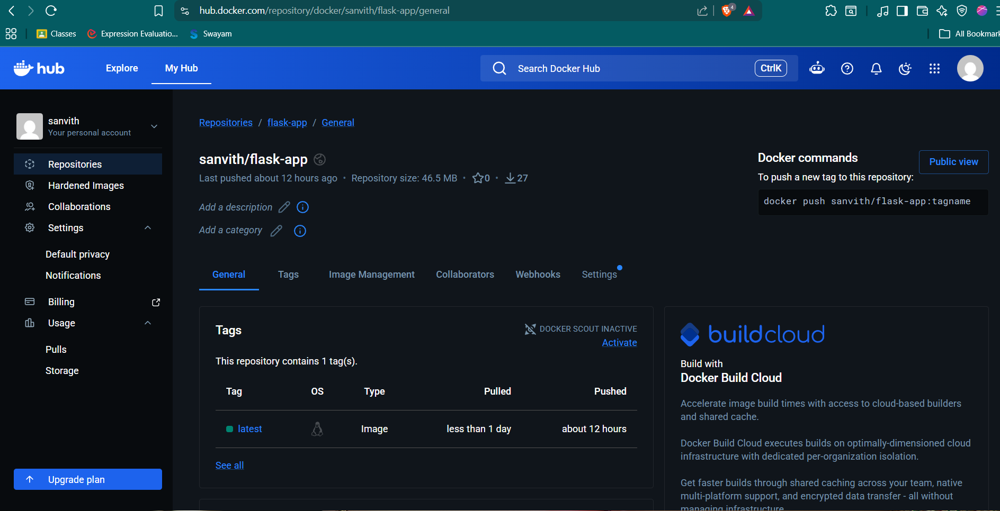
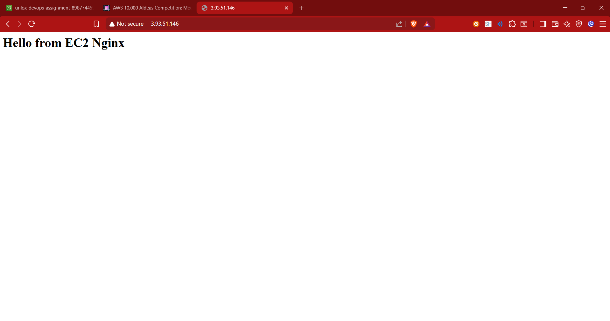
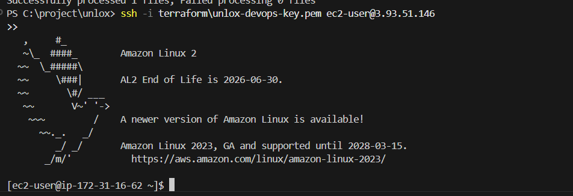

# DevOps Practical Assignment Submission Report

* **Student Name**: Sanvith
* **Docker Hub Username**: `sanvith`
* **GitHub Repository**: [https://github.com/Sanvith6/unlox-devops-practical-assignment.git](https://github.com/Sanvith6/unlox-devops-practical-assignment.git)
* **Assignment Title**: DevOps Practical Assignment (Beginner to Intermediate)
* **Date**: May 28, 2026

---

## 🟢 1. Task 1: S3 Bucket Versioning + Static Website Hosting

* **S3 Static Website URL**: [http://unlox-devops-assignment-898774459947.s3-website-us-east-1.amazonaws.com](http://unlox-devops-assignment-898774459947.s3-website-us-east-1.amazonaws.com)
* **S3 Bucket Name**: `unlox-devops-assignment-898774459947`
* **Versioning Status**: **Enabled** (automating backups and version control)

### 📸 Proof of S3 Hosting
Below is the S3 static page successfully loaded in the browser displaying `"Hello from S3"`:

---

## 🟢 2. Task 2: Custom Dockerfile and Push to Docker Hub

* **Docker Hub Repository Link**: [https://hub.docker.com/r/sanvith/flask-app](https://hub.docker.com/r/sanvith/flask-app)
* **Image Name**: `sanvith/flask-app:latest`
* **Verified Route Handler**: Exposing default root `@app.route('/')` returning `"Hello from Docker"`.

### 📸 Proof of Docker Hub Push
Below is the verified Docker Hub repository dashboard showing the pushed repository and the tag `latest`:

---

## 🟢 3. Task 3: Launch EC2 and Serve Nginx Page

* **EC2 Web Server URL**: [http://3.93.51.146](http://3.93.51.146)
* **EC2 Instance Type**: `t3.micro` (standard free-tier eligible instance type)
* **Automated SSH Key Name**: `unlox-devops-key` (private `.pem` saved to workspace)

### 📸 Proof of EC2 Nginx Web Page
Below is the custom Nginx web page successfully loaded from the EC2 instance's public IP:

### 📸 Proof of Secure SSH Connection
Below is the verified terminal session showing a successful secure SSH connection to the EC2 server using the dynamically generated private key `unlox-devops-key.pem`:

---

## 🛠️ Infrastructure Automation Summary

This entire assignment was provisioned and configured in a **fully automated, reproducible fashion** using:
* **Terraform**: Automating the provisioning of security groups, SSH key pairs, S3 buckets, object uploads, bucket policies, and the EC2 instance.
* **Robust OS-agnostic User Data**: Automating the discovery of system type (Amazon Linux / Ubuntu) and executing the corresponding steps to install, configure, enable, and serve the Nginx page.

### Submission File List
All submission-ready project assets are structured as follows:
* `terraform/main.tf` — Complete Infrastructure Code
* `terraform/outputs.tf` — Dynamic Output definitions
* `terraform/variables.tf` — Input variables config
* `terraform/terraform.tfvars` — Set variables values (Bucket name, AWS region)
* `terraform/s3_website/index.html` — S3 Website static content
* `docker/app.py` — Flask Python code (Task 2)
* `docker/Dockerfile` — Custom Python Docker config (Task 2)
* `docker/requirements.txt` — Python dependencies list
* `proofs/` — Renamed deliverables screenshots (S3, Docker, EC2, SSH)
* `README.md` — Highly polished documentation
* `submission.md` — Active submission summary report
